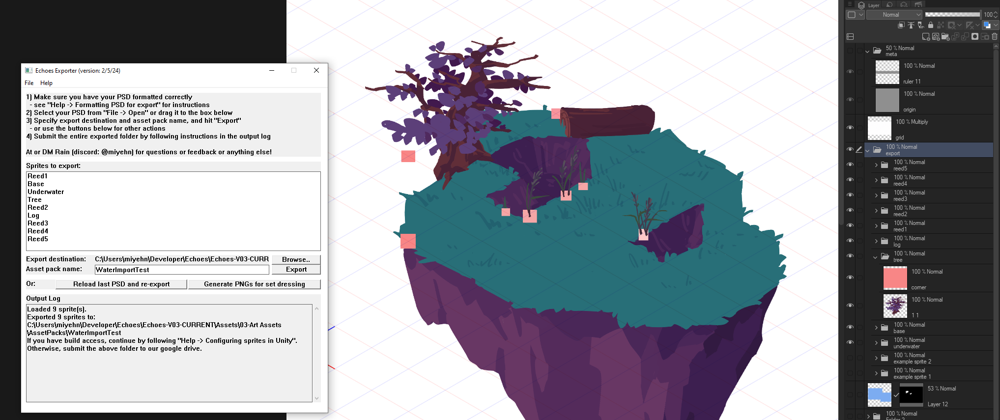
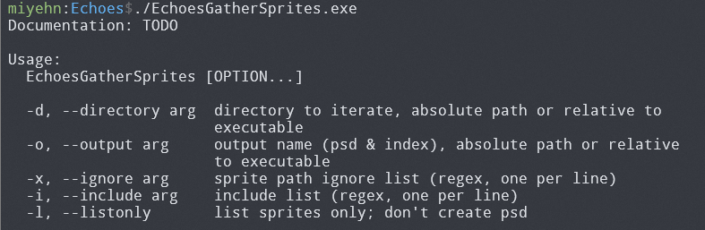
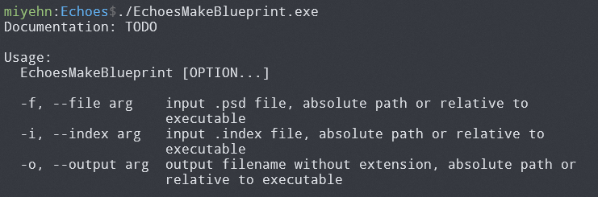

# Echoes Exporter

This is the hub for some of Echoes' art pipeline tools. Below are the 3 relevant build targets.

To learn more about the game Echoes and its art pipeline, see [this documentation page](https://miyehn.me/#page/echoes).

### EchoesExporter_Windowed

A GUI tool that exports props and their position & pivot information directly from PSD layers, to help streamline the 2D art asset workflow from PSD files to Unity prefabs. Unlike other tools, this one has GUI because it was mostly used by artists, who aren't necessarily familiar with the command line. See the "Echoes exporter" section of documentation for details.

[Here](assets/EchoesExporter_Windowed.exe) is the executable. You can run it on [this sample PSD file](assets/sample-psd.psd), or make your own by following [this documentation I wrote](https://docs.google.com/document/d/1PNKSJYEmk9Cz_OFGKrXTKq-tnm2wgDN1cy6o5KLHpAY/edit?usp=sharing).

### EchoesGatherSprites

A command-line script that parses the game project directory and exports a PSD file containing all our 2D props, so they can be reused in environment set-dressing. We mostly do set-dressing in PSD files, not Unity. See the "Island blueprints" section of documentation for details.

It also exports an index file of all props, which is then used by EchoesMakeBlueprint. 

### EchoesMakeBlueprint

A command-line tool that takes the index file and turns the set-dressed scene (a PSD file) into a JSON describing the scene, so Unity can read from it and assemble the exact same scene in the game engine.

---

# psd_sdk
A C++ library that directly reads Photoshop PSD files. The library supports:
* Groups
* Nested layers
* Smart Objects
* User and vector masks
* Transparency masks and additional alpha channels
* 8-bit, 16-bit, and 32-bit data in grayscale and RGB color mode
* All compression types known to Photoshop

Additionally, limited export functionality is also supported.

For more information, please go to: https://molecular-matters.com/products_psd_sdk.html

## Directory structure
### bin
Contains a Photoshop PSD file used by the sample code.

### build
Contains Visual Studio projects and solutions for VS 2008, 2010, 2012, 2013, 2015, 2017, and 2019.

### src
Contains the library source code as well as a sample application that shows how to use the SDK in order to read and write PSD files.

## Platforms

At the moment, the SDK compiles for Windows, MacOS and Linux.
The MacOS port was kindly provided by Oluseyi Sonaiya, the Linux port was done by https://github.com/BusyStudent.

As we are primarily a Windows developer, we don't plan on supporting mobile platforms ourselves. We would gladly accept pull requests though, if anybody wants to help out.

## Porting to other platforms

98% of the code is written in a platform-independent way already. If you want to port the SDK to other platforms, here are the things that need porting:

### PsdNativeFile.cpp:
Provides an implementation of the PsdFile interface and uses native Windows functions for async operations.

### PsdEndianConversion.inl:
Uses either `_byteswap_*` or `__builtin_bswap*` functions. Either of those should be supported by MSVC, Clang, and GCC, but this needs porting for compilers that don't offer any of these functions.

### PsdCompilerMacros.h:
Provides an abstraction over certain compiler/preprocessor features, and should already work for MSVC, Clang, and GCC.

## macOS
When building and debugging the PsdSamples command line utility under Xcode, you will need to edit the current scheme's working directory so that it can locate the supplied PSD file. Set the working directory to be the `build/Xcode directory` inside of wherever you have checked out the `psd_sdk` source code.

Running it directly from the command line is a little trickier; copy the binary from whatever output location it is in to `build/Xcode`, and then execute.
